# Codex-Managed-Agent

<p align="center">
  
</p>

<h3 align="center">A VS Code control surface for managing Codex threads, board workflows, and local runtime behavior.</h3>

<p align="center">
  <strong>Board-based thread management</strong> · <strong>Inspector and logs</strong> · <strong>Loop-aware operations</strong> · <strong>Codex-linked workflow control</strong>
</p>

> **Note:** This extension requires Codex to be installed, authenticated, and able to run properly. CMA is designed to manage and complement Codex workflows, not replace Codex itself.

## What this extension is for

`Codex-Managed-Agent` is built for people who want to work across many Codex threads without treating the official Codex sidebar as the only control surface.

It turns VS Code into a working surface for:

- scanning many threads at once
- grouping and pinning active work
- surfacing `Needs Human` items
- inspecting logs and conversation context
- managing local runtime behavior
- operating across more than one project root

## Core workflows

### Thread management inside VS Code

Use the dashboard to:

- search, filter, sort, and pin threads
- inspect conversation and log context
- manage lifecycle actions
- move between list, board, and inspector views

### Board-based active work

Use the board when you need a higher-signal operating workspace:

- attach important threads to the board
- keep intervention work visible
- resize and reorganize cards
- scan active state without opening every thread manually

### Runtime and local service control

When paired with the local `codex_manager` service, the extension helps with:

- server reachability checks
- local service startup
- degraded-state recovery visibility
- local dashboard integration on `8787`

## Feature highlights

- Native VS Code dashboard in the editor, sidebar, or bottom panel
- Thread search, filter, sort, grouping, and pin workflows
- Board view for active, attached, and intervention work
- Inspector drawer with logs, conversation context, and actions
- Local server awareness with startup and recovery support
- Loop and background-control surfaces for ongoing work
- Cross-surface navigation between dashboard and Codex thread views

## Current Interaction Architecture

The current version of CMA communicates through a few parallel paths rather than one single API:

- CMA webview talks to the extension host through `postMessage`
- the extension host talks to the local `codex_manager` service over HTTP
- the extension host opens or routes Codex native threads through VS Code commands and URI routes
- background prompt continuation uses `codex exec resume`
- Codex open/focused thread state is inferred from the VS Code tab system

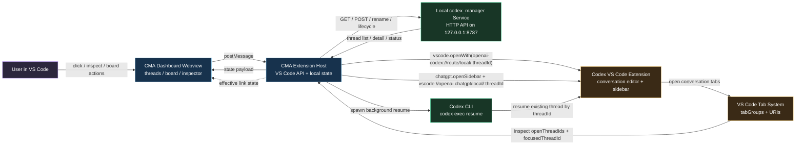

Source files for this diagram:

- [`figures/cma-codex-interaction.mmd`](https://github.com/Harzva/codex-managed-agent/blob/HEAD/figures/cma-codex-interaction.mmd)
- [`figures/cma-codex-interaction.md`](https://github.com/Harzva/codex-managed-agent/blob/HEAD/figures/cma-codex-interaction.md)

## Screenshots

Files live under `docs/screenshots/` so GitHub renders them without external image hosts. Each capture below is **one image per row** with a short caption.

### Overview

**Overview — Agent Task Summary & coordination queue**

High-level counts (threads, board, tabs), the coordination queue (running / handoff / loop), and a snapshot strip for Threads, Board, Live, Inspector, Service, and Loop daemon.

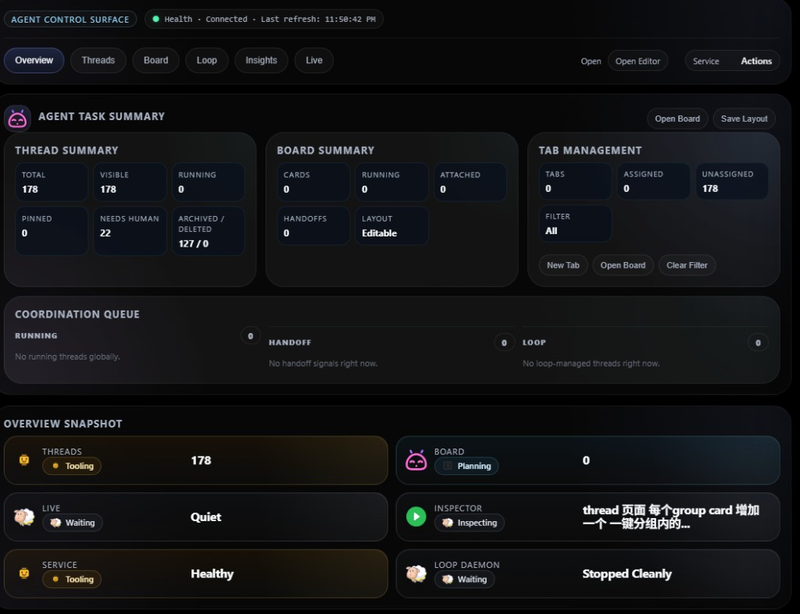

**Overview — full dashboard layout**

Same Agent Control Surface in a wider layout, including the footer branding strip so you can see the full visual chrome of the dashboard.

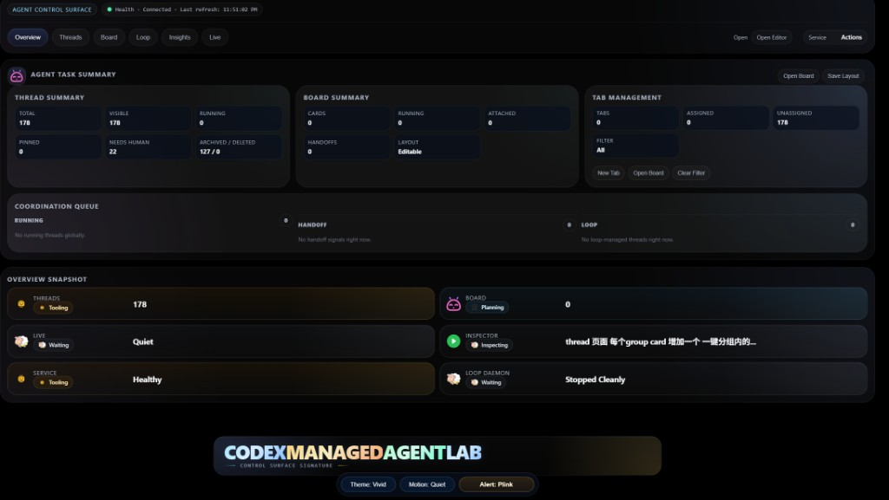

### Threads

**Threads — Thread Explorer**

Search, sort, filters, batch selection, and actions such as New Thread, Refresh, and Scan Sessions—built for scanning many threads without opening each conversation first.

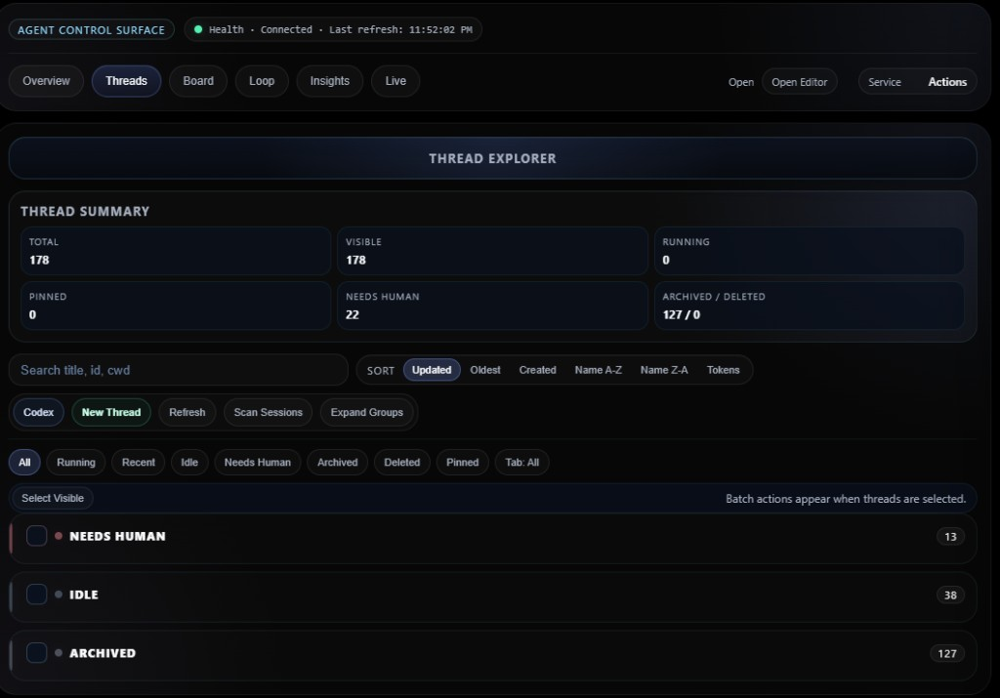

**Threads — grouped list**

Threads grouped by status or workspace root; each row shows status, Inspector, Board, Codex, Pin, and token/size/cmd metadata at a glance.

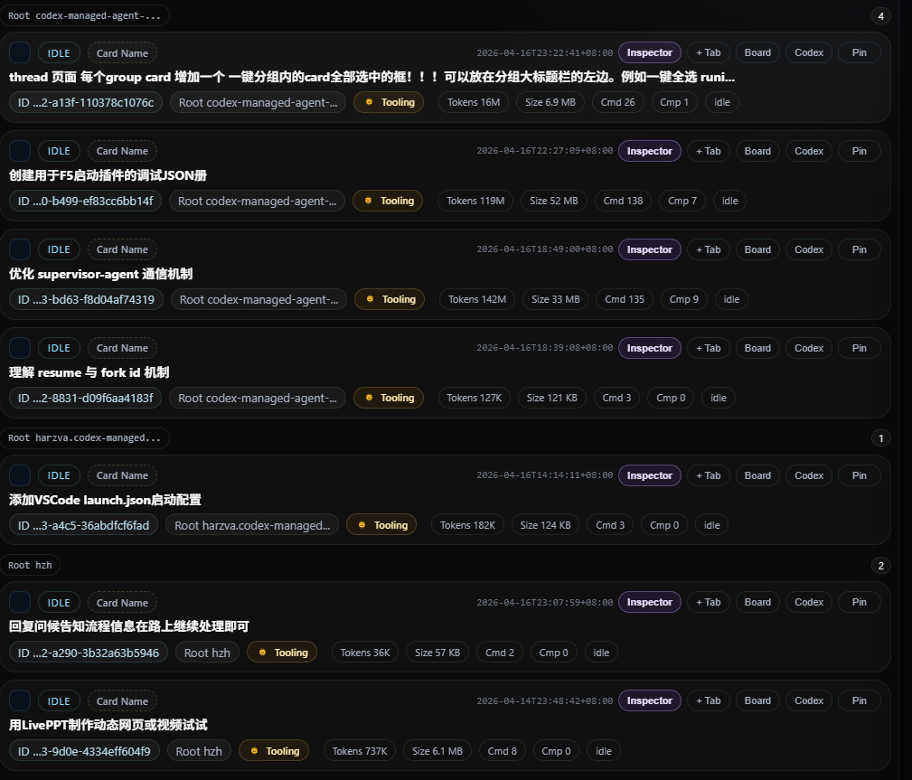

### Board

**Board — canvas**

Board Canvas with cards for active work: size presets, Codex shortcut, status (e.g. IDLE / ATTACHED), and optional tab groups when you organize cards into colored rails.

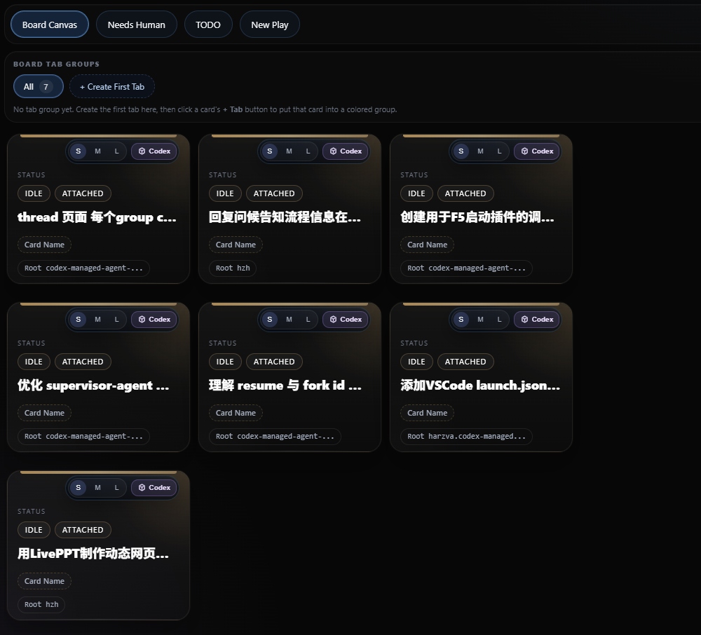

**Board — tab groups**

Board Tab Groups (e.g. custom tabs with counts) so you can split workstreams while keeping cards independent within each group.


### Loop daemons

**Loop — daemon list**

All discovered `codex-loop` workspaces in one list: RUNNING / STOPPED CLEANLY / EXITED UNEXPECTEDLY, with PID, interval, heartbeat, thread id, and quick actions (logs, prompt, tmux, start/stop).

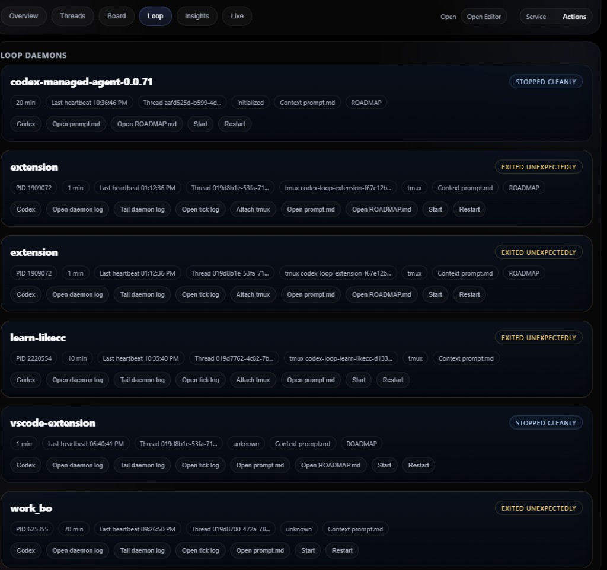

**Loop — daemon detail**

Expanded view of a single daemon: path, metadata chips, last tick summary, and action buttons for recovery and inspection.

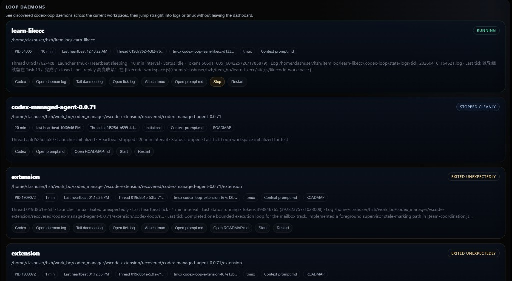

**Loop — with terminal log**

Loop UI alongside integrated terminal (e.g. tailing `daemon_stdout.log`) so you can correlate UI state with live log lines.

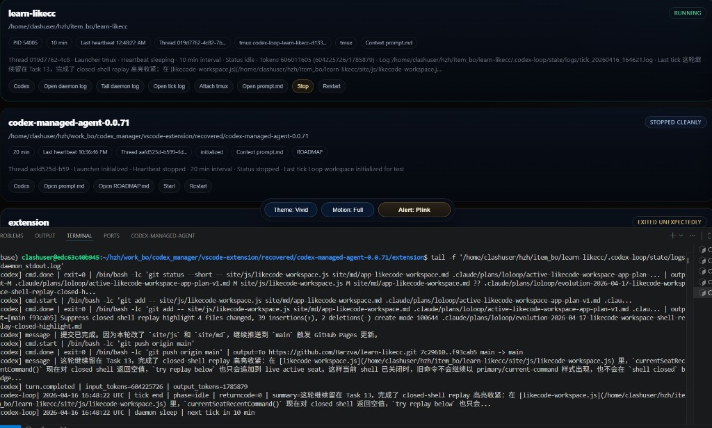

### Insights

**Insights — usage report**

Token headline metrics, trend chart, and top threads by token usage so you can see where spend concentrates.

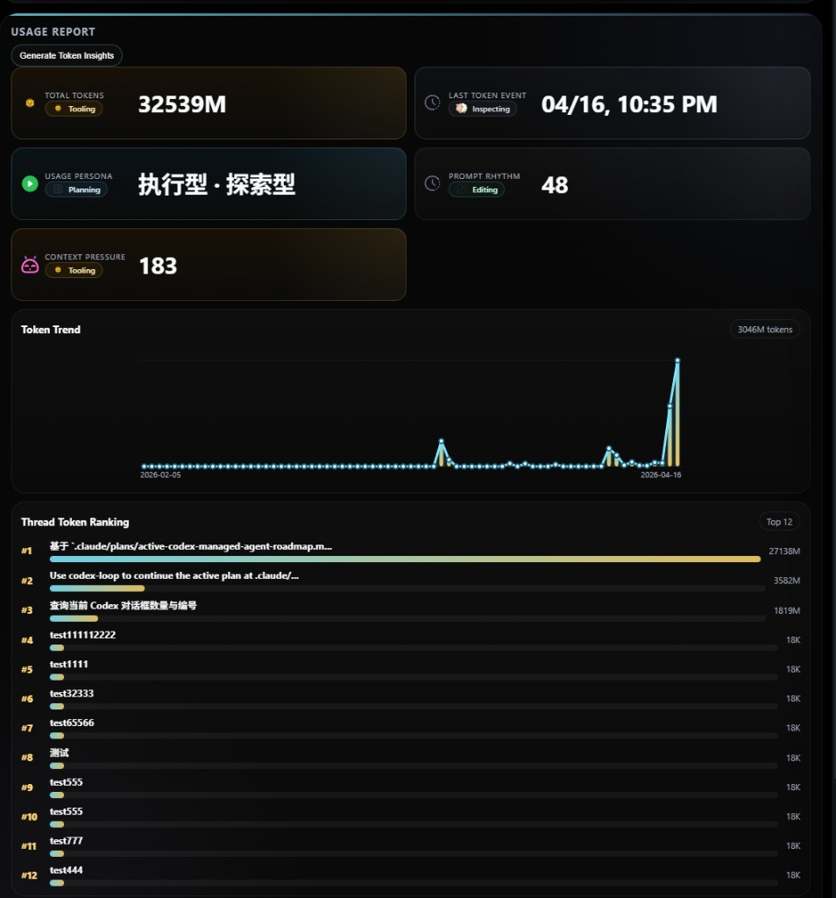

**Insights — topic map & vibe advice**

Topic Map (themes + threads) and Vibe Advice cards grounded in observed prompt and compaction signals.

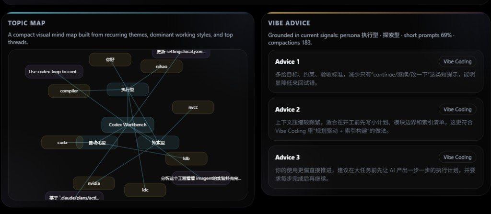

**Insights — behavior signals & heatmap**

Behavior Signals (token pace, token mix, topic map, work rhythm) and Vibe Interaction heatmap from direct user inputs (see in-app basis text for counting rules).


### Extra capture

**Dashboard — alternate framing**

Additional full-width dashboard capture for README / release notes.

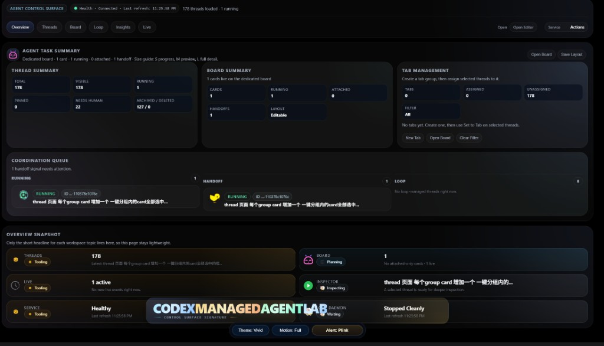

### Screenshot workflow (for maintainers)

If you are updating marketing screenshots or preparing a release, the capture workflow is organized in five layers:

- capture inventory: [`SCREENSHOT_INVENTORY.md`](https://github.com/Harzva/codex-managed-agent/blob/HEAD/SCREENSHOT_INVENTORY.md)
- execution checklist: [`docs/screenshots/CAPTURE_CHECKLIST.md`](https://github.com/Harzva/codex-managed-agent/blob/HEAD/docs/screenshots/CAPTURE_CHECKLIST.md)
- UI preparation plan: [`docs/screenshots/RESOURCE_PLAN.md`](https://github.com/Harzva/codex-managed-agent/blob/HEAD/docs/screenshots/RESOURCE_PLAN.md)
- shoot order: [`docs/screenshots/SCREENSHOT_SHOOT_ORDER.md`](https://github.com/Harzva/codex-managed-agent/blob/HEAD/docs/screenshots/SCREENSHOT_SHOOT_ORDER.md)
- per-shot scene design: [`docs/screenshots/SCENE_DESIGN.md`](https://github.com/Harzva/codex-managed-agent/blob/HEAD/docs/screenshots/SCENE_DESIGN.md)

## Installation

### Install from Marketplace

Search for:

- `Codex-Managed-Agent`

Publisher:

- `harzva`

### Install from VSIX

```bash
code --install-extension codex-managed-agent-1.0.3.vsix
```

Or inside VS Code:

1. Open Extensions
2. Click `...`
3. Choose `Install from VSIX...`
4. Select the generated package

## Local service setup

The extension works best with the local `codex_manager` service.

Start it like this:

```bash
cd <your-workspace>/codex_manager
source .venv/bin/activate
uvicorn codex_manager.app:app --reload --port 8787
```

If the service is not reachable, the extension can try to start it automatically.

## Development workflow

1. Open this extension folder in VS Code
2. Press `F5`
3. Choose `Run Codex Agent Extension` if prompted
4. In the Extension Development Host, run:
   - `Codex-Managed-Agent: Open Dashboard`

Useful placement commands:

- `Codex-Managed-Agent: Open Dashboard`
- `Codex-Managed-Agent: Show in Sidebar`
- `Codex-Managed-Agent: Show in Bottom Panel`
- `Codex-Managed-Agent: Open to Side`
- `Codex-Managed-Agent: Full Screen`
- `Codex-Managed-Agent: Move to New Window`

## Configuration

### `codexAgent.baseUrl`

- default: `http://127.0.0.1:8787/`
- use this when your local dashboard is running on a different URL or port

### `codexAgent.autoStartServer`

- default: `true`
- attempts to start the local service when the panel cannot connect

### `codexAgent.pythonPath`

- optional override for the Python executable used to launch the local service

### `codexAgent.serverRoot`

- optional absolute path to the local `codex_manager` service root

## Commands

- `Codex-Managed-Agent: Open Dashboard`
- `Codex-Managed-Agent: Show in Sidebar`
- `Codex-Managed-Agent: Show in Bottom Panel`
- `Codex-Managed-Agent: Open to Side`
- `Codex-Managed-Agent: Full Screen`
- `Codex-Managed-Agent: Move to New Window`
- `Codex-Managed-Agent: Refresh Panel`
- `Codex-Managed-Agent: Open in Browser`
- `Codex-Managed-Agent: Start Local Server`

## Release workflow

Package locally:

```bash
npm run package
```

Before calling a build release-ready, use:

- [`SMOKE_CHECKLIST.md`](https://github.com/Harzva/codex-managed-agent/blob/HEAD/SMOKE_CHECKLIST.md)
- [`CHANGELOG.md`](https://github.com/Harzva/codex-managed-agent/blob/HEAD/CHANGELOG.md)
- [`SCREENSHOT_INVENTORY.md`](https://github.com/Harzva/codex-managed-agent/blob/HEAD/SCREENSHOT_INVENTORY.md)
- [`docs/release-workflow.md`](https://github.com/Harzva/codex-managed-agent/blob/HEAD/docs/release-workflow.md)

## Current status

This extension is published as a stable 1.x build.

The current focus is to make it:

- operationally reliable
- smoother as a board-based control surface
- more usable for multi-thread Codex work inside VS Code

## Repository

- Source: `https://github.com/Harzva/codex-managed-agent`
