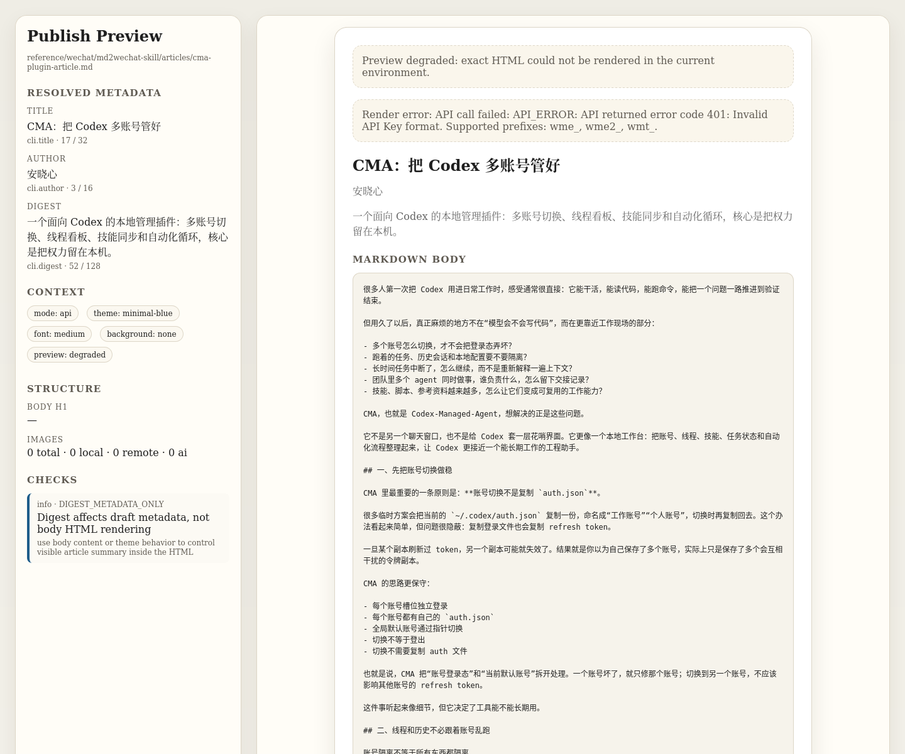
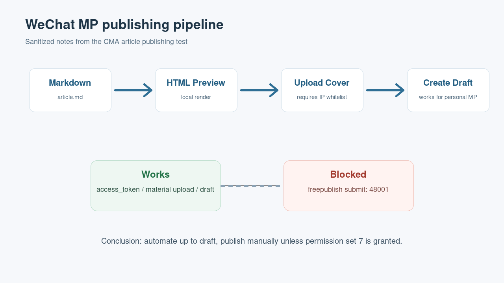
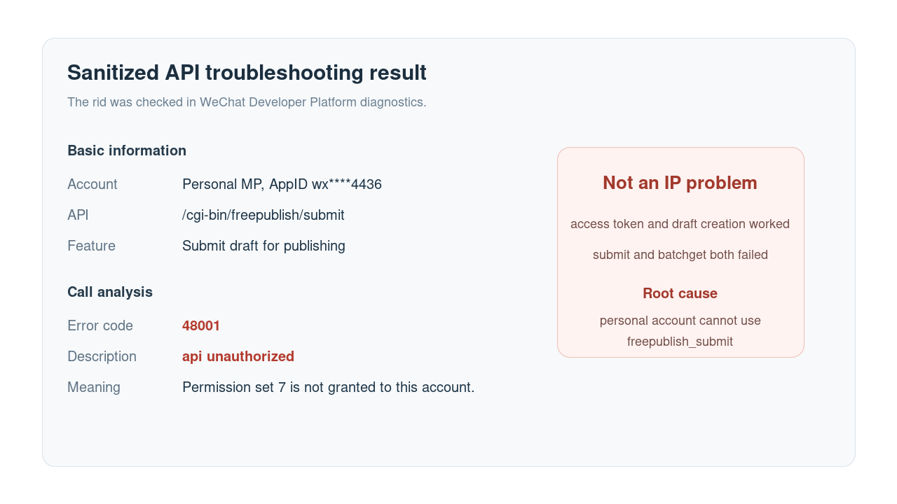
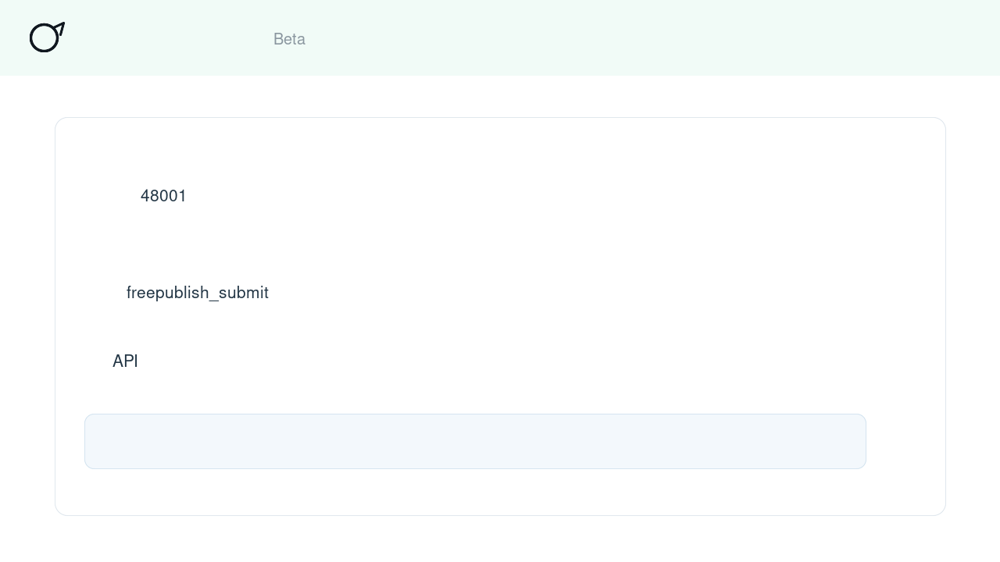
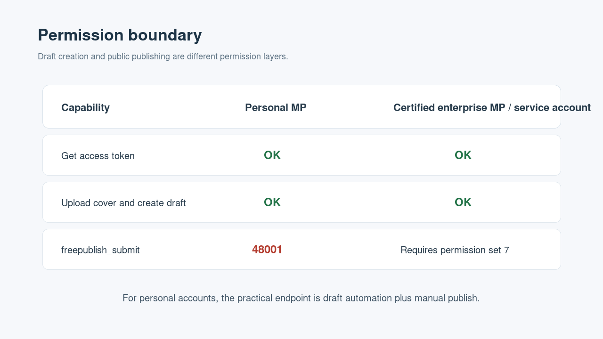

# WeChat MP Publishing API Notes

日期：2026-05-08

## 背景

这次调研围绕一个很具体的目标：把 CMA 插件介绍文章从本地 Markdown 自动整理成公众号草稿，并尽量尝试通过微信 API 公开发布。

最终结论不是“全自动发布成功”，而是更有价值的边界确认：

```text
个人主体公众号：
  可以自动创建草稿
  不能调用 freepublish_submit 自动公开发布
  最后一跳必须在公众号后台手动发布
```

这篇笔记面向后续经验贴整理，保留完整排查路径、脱敏命令模板、错误码判断和可复用经验。

## 脱敏范围

本文保留技术事实，但不保留可直接复用的敏感凭据：

- 不记录 `AppSecret`。
- 不记录 access token。
- 不记录完整素材 URL 中可能携带的参数。
- 公众号 AppID 统一写成 `wx****4436`。
- 不把一次性 `media_id` 作为长期凭据记录。
- 错误 `rid` 只用于说明诊断方法，不作为密钥处理。

如果 `AppSecret` 曾经出现在聊天、截图或日志中，应在微信公众平台重置。

## 相关文档

- 公众号发布能力：<https://developers.weixin.qq.com/doc/subscription/guide/product/publish.html>
- 发布草稿接口：<https://developers.weixin.qq.com/doc/subscription/api/public/api_freepublish_submit.html>
- 获取已发布消息列表：<https://developers.weixin.qq.com/doc/subscription/api/public/api_freepublish_batchget.html>
- 接口报错诊断：<https://developers.weixin.qq.com/doc/oplatform/developers/troubleshooting/>
- 公共错误码：<https://developers.weixin.qq.com/doc/oplatform/developers/errCode/#公共错误码>

## 本地素材

本次发布链路使用的本地结构：

```text
reference/wechat/md2wechat-skill/
  md2wechat.env
  scripts/
    md2wechat
    md2wechat-linux-amd64
  articles/
    cma-plugin-article.md
    cma-plugin-preview.html
    cma-plugin-wechat.html
    cma-plugin-cover.png
```

其中 `reference/` 已被仓库忽略，所以适合放本地工具、生成物和密钥配置。但这只是降低误提交概率，不等于安全存储。密钥文件仍要收紧权限：

```bash
chmod 600 reference/wechat/md2wechat-skill/md2wechat.env
```

`md2wechat.env` 推荐只写运行时变量：

```bash
WECHAT_APPID='wx****4436'
WECHAT_SECRET='REDACTED'
```

## 本地预览

先把 Markdown 转成本地 HTML 或手写公众号兼容 HTML，再在浏览器中检查标题、段落、引用和封面。

这一步的价值是把“文章质量问题”和“微信 API 权限问题”分开。不要一边调权限，一边调排版。



本次经验里，远端 `md2wechat` 排版 API 因 key 格式不匹配失败，因此退回到本地维护的公众号兼容 HTML。这个退路很重要：API 排版不可用时，仍然可以继续走“本地 HTML -> 草稿”的链路。

## 调用链路总览

实际可行链路如下：



可自动化成功的部分：

1. 获取 `access_token`
2. 上传封面素材
3. 创建公众号图文草稿

被权限拦截的部分：

1. 查询已发布文章列表：`/cgi-bin/freepublish/batchget`
2. 提交草稿发布：`/cgi-bin/freepublish/submit`

## 代理与 IP 白名单

微信公众号 `access_token` 相关接口会校验调用方出口 IP 是否在白名单中。典型错误：

```json
{
  "errcode": 40164,
  "errmsg": "invalid ip ... not in whitelist"
}
```

本次排查中踩到两个点：

- 代理出口和直连出口不同。
- 同一网络下直连出口也可能变化。

因此“我加了一个 IP 白名单”不一定足够。需要确认微信诊断页或错误返回里实际看到的调用 IP。

另一个细节是 Go 程序代理变量。只设置小写：

```bash
http_proxy=http://127.0.0.1:7890
https_proxy=http://127.0.0.1:7890
```

不一定能让 CLI 按预期走代理。显式传大写变量更稳：

```bash
HTTP_PROXY=http://127.0.0.1:7890 \
HTTPS_PROXY=http://127.0.0.1:7890 \
ALL_PROXY=http://127.0.0.1:7890 \
MD2WECHAT_USE_PROXY=1 \
reference/wechat/md2wechat-skill/scripts/md2wechat test-draft \
  reference/wechat/md2wechat-skill/articles/cma-plugin-wechat.html \
  reference/wechat/md2wechat-skill/articles/cma-plugin-cover.png \
  --json
```

本地 wrapper 的策略：

- 默认清掉代理变量，让工具走本地直连。
- 需要命中某个已加入白名单的代理出口时，显式设置 `MD2WECHAT_USE_PROXY=1` 和大写代理变量。

## 成功创建草稿

当 IP 白名单、AppID、AppSecret 都正确时，`md2wechat test-draft` 可以成功创建草稿。成功形态类似：

```json
{
  "success": true,
  "code": "TEST_DRAFT_CREATED",
  "message": "Draft created successfully",
  "data": {
    "message": "Draft created successfully! You can check it in WeChat backend."
  }
}
```

这个成功只能说明草稿链路可用，不代表发布链路可用。

关键区分：

```text
创建草稿成功 != API 公开发布成功
```

## freepublish 权限失败

尝试提交草稿发布：

```text
POST /cgi-bin/freepublish/submit
```

返回：

```json
{
  "errcode": 48001,
  "errmsg": "api unauthorized"
}
```

同一权限集下的查询接口：

```text
POST /cgi-bin/freepublish/batchget
```

也返回 `48001`。

这说明问题不是某个草稿的内容，也不是 `media_id` 错，而是发布能力权限集没有授权。



## 开发者智能助手的价值

这次排查中，微信开发者平台里的“开发者智能助手”很有用。它不是替代接口诊断，而是补上了文档和错误码之间的解释层。

接口诊断只能确认：

```text
/cgi-bin/freepublish/submit
48001 api unauthorized
```

开发者智能助手进一步把原因收敛到账号主体和接口权限：

```text
当前账号不具备 freepublish_submit 调用权限。
个人主体账号无法开通该发布能力。
如需使用该接口，需要企业主体已认证公众号/服务号。
```



这个信息对后续经验贴很重要：单看接口文档，容易误以为“公众号文档里有这个接口，所以公众号都能用”。智能助手明确指出，接口存在不等于当前账号有权限，个人主体账号无法通过认证补齐这个能力。

后续遇到类似 `48001` 时，可以把完整问题直接问开发者智能助手：

```text
当前公众号调用 /cgi-bin/freepublish/submit 返回 48001。
接口诊断显示接口适用范围为公众号、服务号。
请确认当前账号是否具备权限集 id=7 发布能力，以及如何开通 freepublish_submit。
```

这种问法比泛泛搜索错误码更快，因为它同时给出了接口路径、错误码、权限集和账号上下文。

## 错误码判断

排查时要先看错误码处在哪一层。

`40164` 是 IP 白名单问题：

```text
invalid ip ... not in whitelist
```

`48001` 是接口权限问题：

```text
api unauthorized
```

`53503`、`53504`、`53505` 才是草稿发布检查问题：

```text
53503 该草稿未通过发布检查
53504 需前往公众平台官网使用草稿
53505 请手动保存成功后再发表
```

本次失败是 `48001`，所以请求没有进入草稿发布检查阶段。继续改标题、封面、正文都无法解决。

## 权限规则

官方文档说明 `freepublish_submit` 属于：

```text
权限集 id：7
```

适用范围说明：

```text
公众号：仅认证
服务号：可调用
```

其中“仅认证”含义是：

```text
仅允许企业主体已认证账号调用，未认证或不支持认证的账号无法调用。
```

如果当前账号是个人主体公众号，即使能使用基础接口、素材接口、草稿能力，也不能直接获得 `freepublish_submit` 发布权限。



## 实测结论

本次账号形态为个人主体公众号，因此结论是：

```text
可行：
  获取 access_token
  上传封面素材
  创建图文草稿
  后台手动发布

不可行：
  freepublish_batchget
  freepublish_submit
  API 自动公开发布
```

如果要 API 自动公开发布，需要：

```text
企业主体已认证公众号或服务号
并获得权限集 id=7 发布能力
```

或者使用第三方平台代商家调用，但那需要商家授权和 `authorizer_access_token`，不是当前 AppID/AppSecret 直连能解决的问题。

## 推荐工作流

对个人主体公众号，推荐把自动化目标定在“草稿箱”：

1. 本地生成 Markdown。
2. 本地生成公众号兼容 HTML。
3. 本地生成封面图。
4. API 上传封面素材。
5. API 创建图文草稿。
6. 在公众号后台检查排版。
7. 人工点击发布。

这个工作流已经能省掉大部分机械步骤，同时避开微信主体权限限制。

## 排查命令模板

获取 token 后测试发布权限：

```bash
source reference/wechat/md2wechat-skill/md2wechat.env

ACCESS_TOKEN=$(HTTP_PROXY=http://127.0.0.1:7890 \
  HTTPS_PROXY=http://127.0.0.1:7890 \
  ALL_PROXY=http://127.0.0.1:7890 \
  curl -s "https://api.weixin.qq.com/cgi-bin/token?grant_type=client_credential&appid=$WECHAT_APPID&secret=$WECHAT_SECRET" \
  | node -e 'let s="";process.stdin.on("data",d=>s+=d);process.stdin.on("end",()=>process.stdout.write(JSON.parse(s).access_token||""))')

HTTP_PROXY=http://127.0.0.1:7890 \
HTTPS_PROXY=http://127.0.0.1:7890 \
ALL_PROXY=http://127.0.0.1:7890 \
curl -s -X POST "https://api.weixin.qq.com/cgi-bin/freepublish/batchget?access_token=$ACCESS_TOKEN" \
  -H "Content-Type: application/json" \
  -d '{"offset":0,"count":10,"no_content":1}'
```

如果返回 `48001`，优先查权限集 7，不要继续调试草稿内容。

提交发布的模板：

```bash
HTTP_PROXY=http://127.0.0.1:7890 \
HTTPS_PROXY=http://127.0.0.1:7890 \
ALL_PROXY=http://127.0.0.1:7890 \
curl -s -X POST "https://api.weixin.qq.com/cgi-bin/freepublish/submit?access_token=$ACCESS_TOKEN" \
  -H "Content-Type: application/json" \
  -d '{"media_id":"DRAFT_MEDIA_ID"}'
```

个人主体账号预期返回：

```json
{
  "errcode": 48001,
  "errmsg": "api unauthorized"
}
```

## 经验贴素材结构

后续可以按下面结构写成公开经验贴：

1. 我想把 Markdown 自动发到公众号。
2. 第一关：排版和本地预览。
3. 第二关：IP 白名单和代理出口。
4. 第三关：草稿创建成功。
5. 第四关：发布接口 `48001`。
6. 最终发现：个人主体公众号没有权限集 7。
7. 实用方案：自动化到草稿，最后手动发布。

推荐标题方向：

```text
个人公众号能不能用 API 自动发文章？我踩完 md2wechat 和 freepublish 的坑
```

或：

```text
从 Markdown 到公众号草稿：个人主体账号的自动化边界
```

## 长期建议

CMA 如果后续内置公众号发布能力，产品上要明确区分：

- `Create Draft`：个人主体可用，推荐默认能力。
- `Publish`：需要权限集 7，应在 UI 中显示账号权限检查。
- `Manual Publish Required`：个人主体账号的正常状态，不应显示成错误。

UI 文案不要承诺“一键发布到公众号”，更准确的是：

```text
一键创建公众号草稿
```

对个人主体账号，这才是稳定可达的自动化边界。
