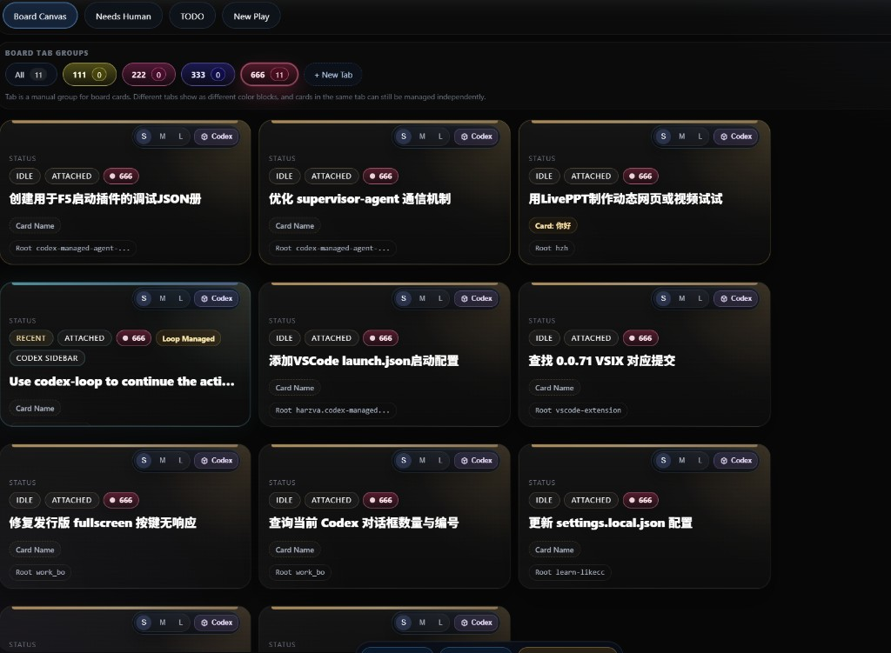
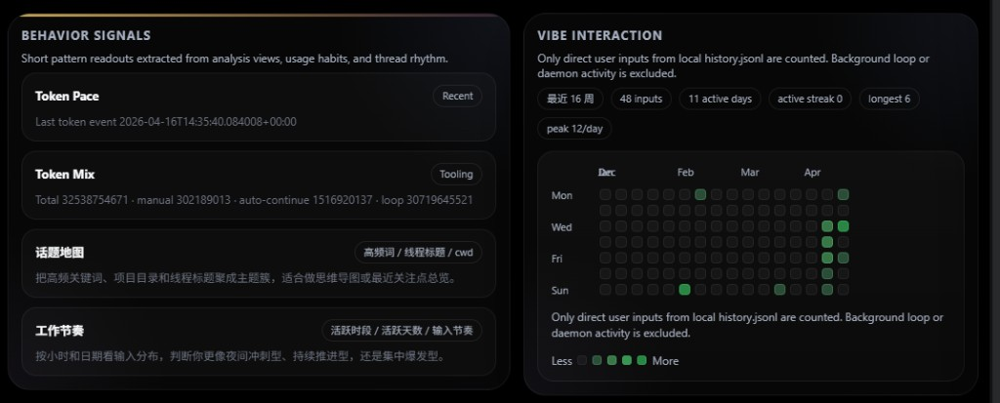
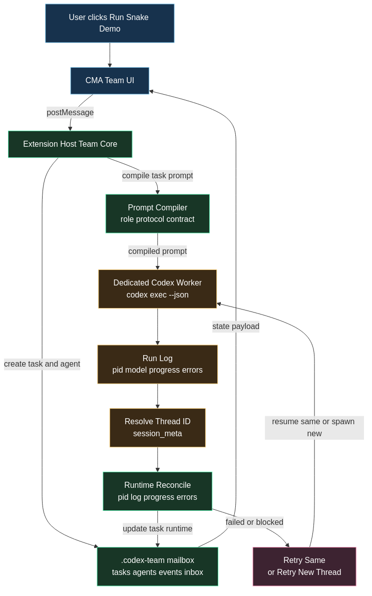
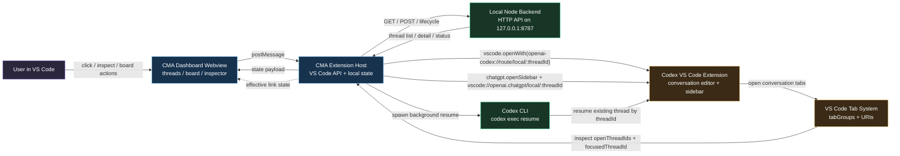

# Codex-Managed-Agent

<p align="center">
  
</p>

<h3 align="center">A local Team Space for Codex: define one task, launch a worker, follow the thread/run/result chain, and keep the evidence auditable inside VS Code.</h3>

<p align="center">
  <strong>Team Space</strong> · <strong>Worker threads</strong> · <strong>Run evidence</strong> · <strong>Failure recovery</strong>
</p>

> **Note:** This extension requires Codex to be installed, authenticated, and able to run properly. CMA is designed to manage and complement Codex workflows, not replace Codex itself.

## Table of Contents

- [Team Space First](#team-space-first)
- [Core Workflows](#core-workflows)
- [Feature Highlights](#feature-highlights)
- [Interface Preview](#interface-preview)
- [How CMA Connects](#how-cma-connects)
- [Installation](#installation)
- [Local Backend Setup](#local-backend-setup)
- [Configuration](#configuration)
- [Commands](#commands)
- [FAQ](#faq)
- [Contributing](#contributing)
- [Repository](#repository)

---

## Team Space First

> **Codex gives you threads; CMA gives you teams of threads with evidence, retry, and observability.**

`Codex-Managed-Agent` is built around a simple local Team Space workflow: create a task, give it a prompt and acceptance criteria, run a dedicated Codex worker, and review the resulting thread, run, logs, trace, and result from one VS Code surface.

Read the Team Workspace mental model for the full Task -> Worker -> Thread -> Run -> Trace -> Result -> Archive flow: [`docs/team-workspace.md`](docs/team-workspace.md).

For informal positioning notes and future README wording, see the CMA README knowledge base: [`docs/readme-knowledge-base.md`](docs/readme-knowledge-base.md).

### Team Space quickstart

1. Open `Codex-Managed-Agent: Open Dashboard`.
2. Go to `Team` and create a Team Space (`Feature`, `Bugfix`, `Review`, or `Demo`).
3. Fill `Task`, `Prompt`, and `Acceptance Criteria`, then start the worker run.
4. Track the live `Thread`, `Run`, and `Trace` evidence from the Team Space page.
5. Review the `Result` and either retry with preserved history or archive the Team Space for audit.

The Team page is meant to feel honest rather than magical:

- each Team Space has one task, one primary worker/thread, current and previous runs, and a visible result state
- plan-mode orchestration drafts make supervisor roles, worker roles, model choices, and write ownership visible before work launches
- raw runtime JSON, compiled prompts, and diagnostics stay behind Advanced surfaces
- archive actions keep workspace files, trace files, and run files available for audit
- failed spaces expose recovery actions instead of leaving you to guess whether anything really happened

Around that Team Space, CMA still gives you the broader operating surface for scanning many Codex threads, grouping active work, inspecting logs, monitoring the local backend, and coordinating across project roots.

## Core workflows

### Thread management inside VS Code

Use the dashboard to:

- search, filter, sort, and pin threads
- inspect conversation and log context
- manage lifecycle actions
- move between list, board, and inspector views

### Board-based active work

Use the board when you need a higher-signal operating workspace:

- attach important threads to the board
- keep intervention work visible
- resize and reorganize cards
- scan active state without opening every thread manually

### Local backend control

The extension ships with a built-in Node backend and helps with:

- backend reachability checks
- local backend startup
- degraded-state recovery visibility
- local dashboard integration on `8787`

### Team Core workflows

Use the Team page to run shared workspace tasks without requiring every user to install a separate Codex skill:

- initialize `.codex-team` state for the current workspace
- create tasks, agents, inbox messages, and event logs
- compile Team prompts with role, mailbox protocol, and result contract
- start a dedicated background Codex worker for the Snake demo
- track PID, log path, model, progress, errors, and resolved thread id
- retry failed work on the same thread or a new dedicated worker

For the vocabulary behind these states and recovery paths, see [`docs/team-workspace.md`](docs/team-workspace.md).

The bundled `team-reflective-loop` skill remains available as an optional enhancement, but Team Core runs without it.

### Trace-backed workflow

Use Team Trace and Thread Trace when you need an evidence surface that is exportable and reviewable inside the product workflow:

- inspect product-level task, thread, and run evidence from the CMA surfaces
- open the append-only raw JSONL lanes behind the current trace view
- export a Markdown trace report with task/thread/run evidence summary, timeline, files, commands, checks, errors, and raw trace links
- share reviewable local evidence without depending on a separate report generator

Important scope:

- CMA trace is a product-level trace surface built from the local extension, backend, Team state, and trace lanes it owns
- it is not a raw Codex API request/response capture or a full model transcript interception layer
- the current export path is Markdown-first; HTML reports can come later if the Markdown shape remains useful

## Feature highlights

- Native VS Code dashboard in the editor, sidebar, or bottom panel
- Thread search, filter, sort, grouping, and pin workflows
- Board view for active, attached, and intervention work
- Inspector drawer with logs, conversation context, and actions
- Local Node backend awareness with startup and recovery support
- Loop and background-control surfaces for ongoing work
- Built-in Team Core with `.codex-team` task state, real background dispatch, runtime logs, and retry actions
- Trace-backed Thread/Team evidence with Markdown report export and raw JSONL links
- Cross-surface navigation between dashboard and Codex thread views

## Interface Preview

### Overview Dashboard

Open with a compact summary of active sessions, service health, board state, and high-level workspace signals.


### Thread Explorer

Search, group by project directory, inspect metadata, and jump into Codex-linked threads from one native VS Code surface.


### Agent Board

Pin important work, keep stopped-but-attached threads visible, and manage card actions directly from the board.



### Insights

Review token usage, model activity, tool calls, and session-level summaries across loaded Codex work.



### Loop Control

Monitor loop daemon state and background continuation workflows without leaving VS Code.


### Team Core

Start a real Team task, launch a dedicated Codex worker, watch PID/log/progress, and retry failures without depending on a manually installed skill. The rendered workflow stays inline here; the Mermaid source stays linked below for reference.



Diagram source:

- [`figures/team-core-workflow.mmd`](https://github.com/Harzva/codex-managed-agent/blob/HEAD/figures/team-core-workflow.mmd)
- [`figures/team-core-workflow.md`](https://github.com/Harzva/codex-managed-agent/blob/HEAD/figures/team-core-workflow.md)

## How CMA Connects

`Codex-Managed-Agent` does not replace Codex. It adds an operating surface around the existing Codex extension, the local CMA backend, and the Codex CLI.

In practice that means:

- the CMA webview renders dashboard, board, Team Core, and loop surfaces
- the extension host keeps local state and routes actions
- the built-in Node backend serves thread and dashboard data
- Codex CLI powers background resume and Team worker dispatch
- Codex thread focus still resolves through native VS Code and Codex thread views



Source files for this diagram:

- [`figures/cma-codex-interaction.mmd`](https://github.com/Harzva/codex-managed-agent/blob/HEAD/figures/cma-codex-interaction.mmd)
- [`figures/cma-codex-interaction.md`](https://github.com/Harzva/codex-managed-agent/blob/HEAD/figures/cma-codex-interaction.md)

## Installation

### Install from Marketplace

Search for:

- `Codex-Managed-Agent`

Publisher:

- `harzva`

### Install from VSIX

```bash
code --install-extension publisher/codex-managed-agent-1.0.37.vsix
```

Or inside VS Code:

1. Open Extensions
2. Click `...`
3. Choose `Install from VSIX...`
4. Select the generated package

## Local backend setup

The extension starts its built-in local Node backend automatically.

By default it binds to:

```text
http://127.0.0.1:8787/
```

If that port is unavailable, the extension probes nearby local ports and reports the active backend in the dashboard health line.

### Legacy backend rollback

The extension is now Node-native. Users who still need the removed legacy backend should stay on, or locally check out, a build before the `Remove Python backend surface` change (`9622c43`) while migrating their workflow.

## Contributing

See [`CONTRIBUTING.md`](CONTRIBUTING.md) for development setup, testing commands, and demo workflows.

## Release workflow

For local packaging:

```bash
npm run package
```

For contributor-facing release prep, use the repo checklists and inventories:

- [`SMOKE_CHECKLIST.md`](https://github.com/Harzva/codex-managed-agent/blob/HEAD/SMOKE_CHECKLIST.md)
- [`CHANGELOG.md`](https://github.com/Harzva/codex-managed-agent/blob/HEAD/CHANGELOG.md)
- [`SCREENSHOT_INVENTORY.md`](https://github.com/Harzva/codex-managed-agent/blob/HEAD/SCREENSHOT_INVENTORY.md)

## Configuration

### `codexAgent.baseUrl`

- default: `http://127.0.0.1:8787/`
- use this when the built-in local backend should bind to a different URL or port

### `codexAgent.defaultSurface`

- default: `editor`
- controls the first dashboard placement

### `codexAgent.smartMode`

- default: `false`
- enables API/model-aware status surfacing such as usage-limit warnings

### `codexAgent.defaultCodexModel`

- default: empty
- optional model name for Team dispatches and background prompts
- empty means Codex CLI chooses its configured default model

### `codexAgent.showExternalClaudeDaemons`

- default: `false`
- shows external Claude/claude-loop daemon diagnostics only when explicitly enabled

## Commands

- `Codex-Managed-Agent: Open Dashboard`
- `Codex-Managed-Agent: Show in Sidebar`
- `Codex-Managed-Agent: Show in Bottom Panel`
- `Codex-Managed-Agent: Open to Side`
- `Codex-Managed-Agent: Full Screen`
- `Codex-Managed-Agent: Move to New Window`
- `Codex-Managed-Agent: Refresh Panel`
- `Codex-Managed-Agent: Open in Browser`
- `Codex-Managed-Agent: Start Local Backend`

## Release workflow

For local packaging:

```bash
npm run package
```

For contributor-facing release prep, use the repo checklists and inventories:

- [`SMOKE_CHECKLIST.md`](https://github.com/Harzva/codex-managed-agent/blob/HEAD/SMOKE_CHECKLIST.md)
- [`CHANGELOG.md`](https://github.com/Harzva/codex-managed-agent/blob/HEAD/CHANGELOG.md)
- [`SCREENSHOT_INVENTORY.md`](https://github.com/Harzva/codex-managed-agent/blob/HEAD/SCREENSHOT_INVENTORY.md)

## FAQ

**Q: The backend port is already in use.**
A: CMA will probe nearby ports automatically. Check the dashboard health line for the active port, or set `codexAgent.baseUrl` to a different URL.

**Q: Codex CLI is not found.**
A: Make sure `codex` is installed and authenticated. Run `codex --version` in your terminal to verify.

**Q: Smart mode warnings appear frequently.**
A: Smart mode (`codexAgent.smartMode`) surfaces API/model-aware status. If you see too many warnings, disable it in settings.

**Q: How do I clear `.codex-team` state?**
A: Close the dashboard, delete the `.codex-team/` folder in your workspace root, then reopen the dashboard. CMA will reinitialize on next use.

**Q: The panel shows stale data.**
A: Click `Reload` in the service banner, or run `Codex-Managed-Agent: Refresh Panel` from the command palette.

## Current status

Actively developed; core Team Space and trace workflows are stable. The project welcomes contributions — see [`CONTRIBUTING.md`](CONTRIBUTING.md).

## Repository

- Source: `https://github.com/Harzva/codex-managed-agent`
