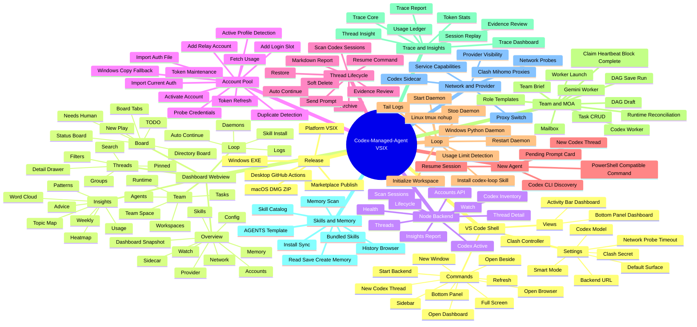

# CMA VSIX Feature Map and Desktop Parity Checklist

> 目标：把 VSIX 版到底有哪些功能一次性摊开，并给桌面 EXE 建立一对一复刻检查表。桌面端不是照抄 VS Code 壳层，而是给每个 VSIX 能力提供桌面等价实现、验收证据和状态。

## 使用规则

- `cma/` 是功能基线，`desktop-electron/` 是桌面落地目标。
- `reference/**`、`cmabuild/**`、本地构建产物不作为功能基线，不进入复刻范围。
- 每个功能节点只有三种完成口径：
  - `Done`：桌面已有等价 UI、API/host 能力、测试或手动验收证据。
  - `Partial`：桌面已有部分数据或骨架，但用户不能完成 VSIX 等价任务。
  - `Missing`：桌面没有可用入口或没有接入真实 host 能力。
- VS Code 专属能力必须转换为桌面等价能力，例如 webview sidebar 转为桌面导航页，VS Code terminal 转为 PowerShell/CMD/PTY 启动，workspace/global state 转为 Electron `userData`。
- 桌面复刻完成标准：下方检查表所有 P0/P1 项必须是 `Done`，P2 项必须是 `Done` 或明确标记 `Desktop N/A` 并说明原因。

## 证据来源

- `cma/package.json`：VSIX 命令、视图、配置项、发布脚本、依赖。
- `cma/src/host/*`：VSIX host 层真实能力，包括账号池、会话生命周期、Loop、Team/MOA、Memory、Skills、Network、Trace、Usage。
- `cma/src/host/node-backend/server.js`：桌面/本地 dashboard 可复用的 HTTP API 基线。
- `cma/src/webview/*`：VSIX 用户界面信息架构、面板、按钮、postMessage 动作。
- `desktop-electron/*`：当前桌面端 shell、renderer、main/preload、vendor backend、GitHub Actions 构建目标。

## 功能导图

## 一对一复刻检查表

| ID | VSIX 功能节点 | VSIX 证据 | 桌面等价目标 | 当前桌面状态 | 优先级 | 验收证据 |
| --- | --- | --- | --- | --- | --- | --- |
| S1 | VS Code Shell / Commands | `cma/package.json`, `cma/src/host/commands.js` | 桌面菜单、顶部操作、刷新、外部浏览器、新窗口、启动/重启后端 | Partial | P1 | UI 可触发同等操作，Electron main 有审计日志 |
| S2 | VS Code Views | `codexAgent.sidebar`, `codexAgent.bottom` | 单窗口多模块导航，必要时支持弹窗/新窗口 | Partial | P1 | 左侧导航和桌面窗口覆盖 Overview/Threads/Board/Team/Loop/Insights |
| S3 | VSIX Settings | `codexAgent.*` configuration | 桌面设置页，保存到 Electron `userData/settings.json` | Partial | P1 | 设置项完整映射，重启后保留 |
| B1 | Backend health / threads / detail | `node-backend/server.js` `/api/health`, `/api/threads`, `/api/thread/:id` | 桌面 API proxy + vendor backend | Done | P0 | `desktop-electron npm test` 覆盖基础 backend |
| B2 | Watch backend | `/api/watch`, `/api/watch/control`, `/api/watch/auto-continue` | 桌面 Watch 页和控制按钮 | Partial | P0 | 可以列出 watchlist 并显式 stop/resume |
| B3 | Insights backend | `/api/insights/report`, `usage-ledger.js` | 真实用量页、重建用量、导出报告 | Partial | P1 | 可触发 ingest/rebuild，展示 token 趋势 |
| B4 | Codex active / inventory | `/api/codex/active`, `/api/codex/inventory`, `platform-runtime.js` | 桌面环境诊断和 Codex 可执行文件选择 | Partial | P0 | Windows 识别 `codex.cmd`/`codex.exe`，展示 source |
| A1 | Account list payload | `account-manager.js`, `account-usage.js` | 账号池表格读取真实账号列表 | Partial | P0 | `/api/accounts` 数据进入 UI，不再用 inventory 模拟账号 |
| A2 | Add login slot | `prepareAccountLogin`, webview `addCodexAccount` | 创建隔离登录槽并打开登录终端 | Missing | P0 | Windows 打开 PowerShell `codex login --device-auth` |
| A3 | Import account | `importCurrentAuthAsProfile`, `importAuthFileAsProfile` | 导入当前 auth 或选择 auth.json 文件 | Partial | P0 | UI 完成导入，错误可见，备份路径可打开 |
| A4 | Activate account | `activateAccountForCodex`, `detectActiveProfile` | 一键激活账号，Windows symlink 失败 copy fallback | Partial | P0 | 无开发者模式 Windows method=`copy` 仍成功 |
| A5 | Token refresh and maintenance | `refreshAccountToken`, `refreshAllOfficialTokens` | 单账号刷新、全量维护、状态提示 | Missing | P0 | token health/过期时间/刷新结果可见 |
| A6 | Usage fetch | `fetchAccountUsage`, `usage-ledger.js` | 拉取账号额度、写入/展示本地 ledger | Missing | P1 | 表格展示 5h/7d 或 relay 用量窗口 |
| A7 | Credential probe / duplicate warnings | `probeAccountCredentials`, `computeDuplicateAccountWarnings` | 账号健康检查、重复账号提示 | Missing | P1 | UI 标红重复 source/credential |
| T1 | Thread explorer | `thread-explorer.js`, `thread-runtime.js` | 会话页搜索、筛选、排序、分组、置顶 | Missing | P0 | 桌面可完成 VSIX Threads 的常用浏览任务 |
| T2 | Thread detail drawer | `drawer-runtime.js`, `thread-insight-panel.js` | 桌面详情抽屉：conversation、logs、git、trace、insight | Missing | P0 | 点击任一 session 可查看完整证据 |
| T3 | Lifecycle actions | `lifecycle.js`, `/api/threads/lifecycle` | archive/restore/soft delete/scan | Partial | P0 | UI 操作后 sessions 状态更新 |
| T4 | Resume / run command | `actions.js`, `auto-continue.js`, `platform-runtime.js` | 桌面终端运行 resume/send prompt，支持 PowerShell quoting | Missing | P0 | Windows 点击 Resume 生成可执行命令并启动 |
| T5 | Evidence and Markdown report | `trace-report.js`, `thread-insight.js` | 导出 Markdown report、生成 evidence review | Missing | P1 | 报告写入用户可见目录并可打开 |
| N1 | New Codex thread | `codex-link.js`, command `newThreadInCodexSidebar` | 桌面新建 Codex thread 或打开 Codex CLI new session | Missing | P0 | 可从桌面创建新会话并进入监控列表 |
| N2 | Pending prompt card | `lifecycle-new-agent.js`, thread runtime chunks | 桌面展示 queued/failed prompt 状态 | Missing | P1 | 发送 prompt 后状态和日志可追踪 |
| L1 | Loop page | `lifecycle-loop.js`, webview Loop pane | Loop daemon 列表、状态、日志、操作按钮 | Missing | P0 | 可看到 daemon running/stopped/limited |
| L2 | codex-loop skill install/sync | `bundled-skills.js`, `lifecycle-loop.js` | 安装/同步 bundled skill | Missing | P0 | 一键安装到 Codex skills root |
| L3 | Start/stop/restart daemon | `startLoopDaemon`, `stopLoopDaemon`, `restartLoopDaemon` | 桌面 daemon 控制，Windows 原生 Python daemon | Missing | P0 | Windows 不调用 `.sh`，日志持续写入 |
| L4 | Log tail / attach | `tailLoopLog`, `attachLoopTmux` | Windows `Get-Content -Wait`，macOS/Linux 保留 tmux/nohup 等价 | Missing | P1 | 桌面可打开实时日志 |
| W1 | Auto continue | `auto-continue.js`, Watch surface | 配置 prompt/count、stop/resume、结果推断 | Partial | P0 | 有次数上限、失败结果、显式停止 |
| M1 | Team Space | `team-coordination.js`, `team-brief.js` | 初始化 team space，打开 brief，读取 readiness | Missing | P1 | 桌面可创建/检查 team workspace |
| M2 | Task CRUD and workflow | `team-actions.js`, `team-coordination.js` | 创建/指派/claim/heartbeat/block/complete/mark stale | Missing | P1 | UI 可驱动 team tasks 全生命周期 |
| M3 | Worker launch | `team-worker-launcher.js`, `gemini-cli-runner.js` | Codex/Gemini worker 启动、preflight、账号绑定、日志 | Missing | P1 | Windows Gemini 不依赖 Bash |
| M4 | MOA DAG | `moa-core.js`, `moa-default-workers.js`, `team-orchestration-launch.js` | DAG draft/save/run，worker 结果回收 | Missing | P2 | 可运行一次小型 DAG 并形成 trace |
| M5 | Runtime reconciliation | `team-runtime-reconciliation.js` | 运行态进度、完成 worker envelope 摄取 | Missing | P2 | UI 显示 worker batch/progress/result |
| R1 | Trace core | `trace-core.js` | 桌面写入/读取 team/thread trace | Missing | P1 | 操作产生 trace JSONL |
| R2 | Trace dashboard/session replay | `trace-dashboard.js`, `drawer-runtime.js` | 时间线、命令、diff、token、工具调用预览 | Missing | P1 | 任一 thread 可打开 replay |
| R3 | Thread insight/advice | `thread-insight.js` | 生成流程步骤、建议、evidence review | Missing | P2 | 可选 AI 分析结果落缓存 |
| R4 | Insights panels | `insights.js`, `insights-panels.js`, `insights-topic-map.js` | Usage/topic/advice/weekly/patterns/heatmap/word cloud | Missing | P2 | 桌面 Insights 与 VSIX 同级 |
| K1 | Skill catalog | `skill-manager.js`, `bundled-skills.js` | 扫描、搜索、详情、安装、同步 skills | Missing | P1 | Skills 页列出 bundled/installed |
| K2 | Memory manager | `memory-manager.js`, `skills-memory-runtime.js` | 扫描 project/global/system memory，读/写/创建 | Missing | P1 | Memory 页可编辑 AGENTS.md/记忆文件 |
| K3 | History browser | `memory-manager.js` history functions | 浏览本地 history JSONL | Missing | P2 | 可按项目打开历史摘要 |
| P1 | Provider visibility | `provider-visibility.js` | Codex config、rollout provider、Desktop SQLite 可见性审计 | Missing | P1 | Provider 页能指出不一致来源 |
| P2 | Service capabilities | `service-capabilities.js` | 功能可用性矩阵、依赖缺失提示 | Missing | P1 | 缺 Codex/Gemini/Clash 时 UI 明确提示 |
| P3 | Codex sidecar | `codex-link.js` | 官方 Codex VS Code extension 状态在桌面中降级为外部集成诊断 | Missing | P2 | Desktop N/A 或外部链接策略明确 |
| X1 | Network probes | `network-tools.js` | 网络检测、OpenAI/Codex endpoint probe | Missing | P1 | Probe 结果有 latency/error/detail |
| X2 | Clash/Mihomo control | `network-tools.js`, config keys | 读取 proxies、切换 selector、保存 controller 配置 | Missing | P1 | 代理切换有审计和失败提示 |
| G1 | Git/workspace metadata | `session-git.js`, thread detail | 桌面显示分支、dirty 状态、文件路径、打开目录 | Partial | P1 | thread row/detail 有 git 信息 |
| U1 | UI parity shell | `panes.js`, `styles.js` | CodexManager 风格但覆盖 CMA 全模块 | Partial | P0 | Dashboard、账号、线程、Board、Team、Loop、Insights 页面均可用 |
| U2 | Density and accessibility | webview styles, desktop renderer | 浅色专业控制台、密集表格、无重叠、键盘可达 | Partial | P1 | 1366x768 和宽屏截图验收 |
| Q1 | Tests | `*.test.js`, desktop tests | 共享 host vendor 检查、Windows native tests、desktop API tests | Partial | P0 | `npm test` + VSIX node tests 通过 |
| Q2 | Release | VSIX scripts, desktop package scripts, Actions | 平台 VSIX、Windows EXE、macOS DMG/ZIP，一键统一发布 | Partial | P1 | Actions artifact 和 release manifest |

## 快速复刻顺序

1. P0 操作闭环：账号池 A1-A5、Threads/Detail T1-T4、Watch/Auto Continue B2/W1、Loop L1-L3。
2. P1 运营能力：Insights/Usage B3/A6、Skills/Memory K1-K2、Provider/Network P1-P2/X1-X2、Trace R1-R2。
3. P1/P2 多 agent：Team M1-M3、MOA M4-M5、Thread insight R3、完整 Insights R4。
4. 发布和验收：UI polish U1-U2、测试 Q1、统一发布 Q2。

## 桌面复刻门禁

- 每新增一个桌面页面，必须绑定真实 backend/host 数据；允许空状态，不允许长期 mock 成真实功能。
- 每新增一个危险操作，必须有审计记录：账号激活、auth 导入、token refresh、终端命令、worker launch、daemon start/stop、proxy switch。
- Windows 验收必须单独写清楚：PowerShell quoting、`codex.cmd`/`codex.exe` 探测、无开发者模式 symlink fallback、无 Bash Gemini worker、日志 tail。
- VSIX 与桌面共享能力优先通过 `desktop-electron/scripts/sync-vsix-host-to-desktop.mjs` 同步；如果必须 desktop-only adapter，要在本表对应节点说明。
- 任意节点从 `Partial` 改为 `Done` 时，必须补一个验收证据：测试名、手动步骤、截图路径、Actions run，四选一以上。
